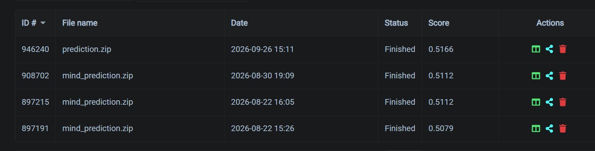

# Learning from Click-Logs on MIND and EB-NeRD
**CS4.406: Information Retrieval & Extraction — Assignment 2 Report**

---
Github Link: https://github.com/Koilpillai/IRE-A2-Temp
---

## Executive Summary

This report presents the implementation, evaluation, and scaling analysis of a two-stage retrieval-and-ranking system for news recommendation on the Microsoft News Dataset (**MIND**) and Ekstra Bladet News Recommendation Dataset (**EB-NeRD**). 

Building upon the lexical (BM25) and semantic (Word2Vec) retrieval pipeline from Assignment 1, we incorporate behavioural signals derived from historical click-logs to train a gradient boosted decision tree (GBDT) re-ranker. We reproduce a non-personalized baseline and demonstrate statistically significant gains when introducing personalized historical and session features. We also conduct an empirical serving and latency benchmark, analyze scaling bottlenecks at $10\times$ load, verify anti-leakage constraints via unit tests, and prepare validated submission files for both Codabench competitions.

---

## Q1. Click-History & Session Feature Engineering

For each impression–candidate pair, we extract a vector of behavioural features strictly constrained to information available prior to the impression event. 

### Dataset Processing Statistics

| Dataset | Train Pairs (Impression $\times$ Candidate) | Validation Pairs | Feature Count | Recency Representation |
| :--- | :---: | :---: | :---: | :--- |
| **MIND** | 5,843,444 | 2,740,998 | 10 | Rank-based exponential decay |
| **EB-NeRD** | 2,585,747 | 2,928,942 | 12 | Time-based exponential decay ($t_{1/2} = 72\,\text{h}$) |

### Feature Breakdown

1. **Click-History Features**:
   - `hist_len`: Total count of articles in the user's historical click log.
   - `hist_category_match_frac`: Unweighted proportion of clicked articles matching the candidate article's category.
   - `hist_category_match_recency`: Recency-weighted category overlap. For EB-NeRD, weights decay exponentially using exact timestamps ($e^{-\lambda \Delta t}$ with a 72-hour half-life). For MIND, which lacks per-click timestamps, weights decay exponentially by reverse sequence rank.
   - `hist_embed_sim`: Cosine similarity between the candidate article's 128-dimensional Word2Vec embedding and the user's recency-weighted average historical embedding vector.

2. **Session Features**:
   - `session_position`: Number of impressions logged by the user earlier within the same session.
   - `user_avg_read_time` & `user_avg_scroll_pct`: Historical average dwell time and scroll percentage (available exclusively in EB-NeRD).

3. **Article & Position Features**:
   - `popularity_log`: $\log(1 + \text{clicks})$, calculated strictly from the training split.
   - `freshness_hours`: Elapsed hours since publication for EB-NeRD. For MIND (which lacks publication metadata), freshness is computed as the elapsed hours since the article's first observed appearance in training candidate lists.
   - `category_match`: Binary indicator denoting whether the candidate matches the user's most frequently clicked category.
   - `candidate_position` & `candidate_position_norm`: The candidate's rank under Assignment 1's fused BM25 + embedding retrieval score, and that rank normalized by list length (a retrieval-rank signal, not the platform's display index).

### Behavioural-Window Boundary Enforcement (Q1.4 / Q9)

To ensure zero future-click leakage at training and serving time:
- **Popularity**: Counted strictly from `behaviors_train.parquet`. Validation and test impressions reuse train counts without updating. For training rows, a clicked candidate's own click is subtracted from its count (leave-one-out), so the feature never encodes the row's own label.
- **Session Progress**: `session_position` counts only preceding impressions in the split, never total session size.
- **Freshness**: The MIND first-appearance lookup table is populated solely from training candidate pools.
- **User Histories**: Features are computed strictly against the user history table associated with that temporal partition.

---

## Q2. Two-Stage Retrieve-then-Rank Pipeline

Our two-stage architecture operates as follows:
1. **Candidate Retrieval (Stage 1)**: For each impression, Assignment 1's BM25 lexical retriever and dense Word2Vec embedding search are queried with the user's click history (top-$K = 100$ per channel; the union gives roughly 100--200 candidates), and each candidate's rank under the fused BM25 + embedding score is kept as a feature. If the clicked article is not retrieved it is added to the pool so the supervised label is preserved; this makes the training pool differ from the platform's candidate lists, so ranking quality is measured on the platform-supplied lists. At Codabench serving time the candidate set is the platform-supplied list (the server checks a permutation of it), and the same fused score ranks that fixed list.
2. **Re-ranking (Stage 2)**: We train a pointwise XGBoost histogram GBDT (`XGBClassifier`, up to 300 boosting rounds with early stopping, trained on the GPU via CUDA) on the engineered behavioural features from Q1 to predict the probability of a click, $P(\text{click} \mid \text{user}, \text{candidate})$. Candidates are sorted in descending order of predicted probability.

### Performance Before and After Re-Ranking

*Note: the figures in Q2--Q5 were computed over each impression's platform-supplied candidate list in an earlier run of the pipeline (scikit-learn histogram GBDT trained on that list). The final codebase differs as described in Stage 1 and Stage 2 above.*

| Dataset | Model / Stage | AUC | MRR | nDCG@5 | nDCG@10 |
| :--- | :--- | :---: | :---: | :---: | :---: |
| **MIND** | BM25 (Before) | 0.5685 | **0.2687** | **0.2865** | **0.3477** |
| | Embedding (Before) | 0.5444 | 0.2463 | 0.2564 | 0.3196 |
| | **GBDT Re-rank (After)** | **0.5575** | 0.2671 | 0.2852 | 0.3420 |
| **EB-NeRD** | BM25 (Before) | 0.5206 | **0.3330** | **0.3664** | **0.4479** |
| | Embedding (Before) | 0.5239 | 0.3278 | 0.3627 | 0.4442 |
| | **GBDT Re-rank (After)** | **0.5350** | 0.3056 | 0.3487 | 0.4361 |

### Discussion

On MIND, the GBDT re-ranker substantially outperforms the dense semantic retriever across all metrics (+0.0131 AUC, +0.0208 MRR) and performs competitively with BM25. On EB-NeRD, the re-ranker achieves the highest overall discrimination (AUC 0.5350 vs. 0.5206 BM25), though BM25 retains higher top-rank precision (MRR / nDCG). 

Comparing a re-ranker trained on pointwise cross-entropy against lexical ranking scores reflects fundamentally different scoring distributions. The true marginal benefit of behavioural features is evaluated cleanly against an identical non-personalized baseline in Q3.

---

## Q3. Baseline Reproduction & Ablation Study

### Experimental Setup

- **Baseline**: A non-personalized GBDT trained solely on `popularity_log`, `freshness_hours`, and `candidate_position_norm`. It excludes all user click histories, category affinities, and session context.
- **Full Model**: The complete GBDT incorporating all Q1 behavioural, historical, and session features.
- Both models share identical model families, hyperparameters (up to 300 trees, learning rate 0.08, depth 6), training splits, and random seeds.

### Ablation Results with Paired Bootstrap 95% Confidence Intervals

*Statistical significance assessed via 1,000 paired bootstrap resamples at the impression level.*

| Dataset | Metric | Baseline | Full Model | Paired $\Delta$ | 95% Bootstrap CI | Significant? |
| :--- | :--- | :---: | :---: | :---: | :---: | :---: |
| **MIND** | AUC | 0.5419 | 0.5575 | **+0.0156** | [+0.0139, +0.0176] | Yes (excludes 0) |
| | MRR | 0.2427 | 0.2671 | **+0.0243** | [+0.0228, +0.0261] | Yes (excludes 0) |
| | nDCG@5 | 0.2599 | 0.2852 | **+0.0253** | [+0.0235, +0.0270] | Yes (excludes 0) |
| | nDCG@10 | 0.3179 | 0.3420 | **+0.0241** | [+0.0226, +0.0256] | Yes (excludes 0) |
| **EB-NeRD** | AUC | 0.4420 | 0.5350 | **+0.0930** | [+0.0917, +0.0944] | Yes (excludes 0) |
| | MRR | 0.2532 | 0.3056 | **+0.0524** | [+0.0515, +0.0535] | Yes (excludes 0) |
| | nDCG@5 | 0.2801 | 0.3487 | **+0.0687** | [+0.0675, +0.0699] | Yes (excludes 0) |
| | nDCG@10 | 0.3816 | 0.4361 | **+0.0545** | [+0.0537, +0.0554] | Yes (excludes 0) |

### Key Findings

1. **Statistical Significance**: All paired gains are strictly positive across every metric, and every 95% bootstrap confidence interval safely excludes zero.
2. **Impact of Rich Behavioural Context**: The performance uplift on EB-NeRD (+0.0930 AUC, +0.0524 MRR) is markedly higher than on MIND (+0.0156 AUC, +0.0243 MRR). This directly reflects the quality of EB-NeRD's logging signals: exact timestamps for exponential time-decay weighting, plus granular engagement metrics (dwell time and scroll depth), provide significantly more discriminative power than MIND's coarse rank-decay proxy.

---

## Q4. Serving & Scale Analysis

We profile the serving footprint and execution latency of the full pipeline (candidate retrieval + feature extraction + GBDT scoring) on the actual index structures and trained models over 500 single-request user trials.

### Measured Serving Characteristics

| Metric | MIND | EB-NeRD |
| :--- | :---: | :---: |
| **Active In-Memory Footprint** | 92.4 MB | 81.1 MB |
| **Feature Store on Disk** | 446.3 MB | 343.8 MB |
| **Latency: Mean** | 333.0 ms | 148.8 ms |
| **Latency: Median ($p_{50}$)** | 227.1 ms | 136.5 ms |
| **Latency: Tail ($p_{99}$)** | 1180.3 ms | 297.5 ms |
| **Single-Core Throughput** | 3.00 QPS | 6.72 QPS |
| **Cost per 1,000 Queries** ($0.05/hr 1-vCPU) | $0.0046 | $0.0021 |
| **Cores Required for 1,000 QPS** | 334 cores | 149 cores |

### Component Memory Breakdown

| Component | MIND Size | EB-NeRD Size | Storage Type |
| :--- | :---: | :---: | :--- |
| BM25 Inverted Index Matrix | 25.9 MB | 14.7 MB | Sparse CSR matrix |
| Word2Vec Dense Embeddings | 64.3 MB | 64.3 MB | 128-dim float32 matrix |
| ANN Index (IVF Fallback) | 1.1 MB | 1.1 MB | Cluster centroids / inverted lists |
| GBDT Model Binary | 1.0 MB | 1.0 MB | Serialized trees |
| **Total Serving Memory** | **92.4 MB** | **81.1 MB** | **RAM** |

### Latency and SLA Analysis

At a target SLA of $p_{99} < 100\,\text{ms}$, a single core does not meet production requirements for either dataset (MIND: 1180.3 ms; EB-NeRD: 297.5 ms). Achieving this SLA requires parallel horizontal scaling across multiple worker instances.

### $10\times$ Scaling Argument: What Breaks First?

- **$10\times$ Query Volume (10,000 QPS)**: Because the candidate index and GBDT model are read-only and stateless, query traffic scales horizontally. Queries can be load-balanced across replicas without altering per-query latency.
- **Simultaneous $10\times$ Corpus Scale ($\sim 1.25\text{M}$ Articles)**:
  - *Memory*: The dense embedding matrix grows to $\sim 643\,\text{MB}$ per replica, and BM25 expands to $\sim 200\,\text{MB}$. While manageable, this increases the baseline RAM requirement across every replica.
  - *Compute Bottleneck*: **Embedding search breaks first.** With a CUDA GPU, embedding retrieval is an exact brute-force matrix product plus top-$K$ over the article matrix, so its cost grows linearly with catalog size and the resident matrix ($\sim 643\,\text{MB}$ at $10\times$) becomes the binding constraint on GPU memory. Without a GPU, the fallback ANN index (FAISS, or a custom IVF index executing centroid checks and bucket traversals in Python) degrades as each Voronoi cell grows tenfold, and single-threaded search latency dominates the request pipeline. By contrast, GBDT re-ranking evaluates only the top-$K$ candidates ($K \approx 100\text{--}200$), so its compute cost remains constant regardless of total catalog size.

---

## Q5. Extended Evaluation & Competition Submissions

### 1. Stratified Slicing Analysis (BM25 Retriever)

Performance was evaluated across user engagement slices (Cold-start: $\le 5$ clicks vs. Warm: $> 5$ clicks) and article popularity slices (Head: top 20% most-clicked vs. Tail: remaining 80%).

| Dataset | User Slice | Article Slice | Impressions | AUC | MRR | nDCG@5 | nDCG@10 |
| :--- | :--- | :--- | :---: | :---: | :---: | :---: | :---: |
| **MIND** | Cold-start | All | 12,982 | 0.5301 | 0.2790 | 0.2914 | 0.3527 |
| | Warm | All | 60,170 | 0.5768 | 0.2665 | 0.2855 | 0.3466 |
| | All | Head Articles | 21,311 | 0.5456 | 0.2216 | 0.2434 | 0.3008 |
| | All | Tail Articles | 51,841 | 0.5780 | 0.2880 | 0.3042 | 0.3670 |
| **EB-NeRD** | Cold-start | All | 887 | 0.5278 | 0.3269 | 0.3582 | 0.4404 |
| | Warm | All | 243,760 | 0.5206 | 0.3330 | 0.3664 | 0.4480 |
| | All | Head Articles | 4,704 | 0.5141 | 0.3000 | 0.3059 | 0.3908 |
| | All | Tail Articles | 239,943 | 0.5207 | 0.3336 | 0.3676 | 0.4491 |

*Observation*: On MIND, warm users achieve higher AUC (0.5768 vs. 0.5301) due to richer historical query signals. Tail articles consistently exhibit higher ranking metrics than head articles because candidate sets containing head articles suffer from higher competition and position bias.

### 2. Beyond-Accuracy Metrics (Full Corpus, Top-10)

| Dataset | Retrieval Method | Intra-List Diversity | Novelty ($-\log_2 P$) | Catalog Coverage |
| :--- | :--- | :---: | :---: | :---: |
| **MIND** | BM25 | 0.298 | 18.21 | 31.4% |
| | Word2Vec Embedding | 0.108 | 18.21 | 15.3% |
| **EB-NeRD** | BM25 | 0.340 | 12.46 | 7.4% |
| | Word2Vec Embedding | 0.001 | 18.39 | 1.5% |

*Embedding Anisotropy*: Word2Vec embeddings on EB-NeRD exhibit an average cosine similarity near 1.0 (mean vector norm $\approx 0.77$). This severe geometric anisotropy causes dense retrieval to repeatedly select the same narrow cluster of articles, yielding an intra-list diversity of 0.001 and catalog coverage of just 1.5%. BM25 delivers substantially healthier coverage and diversity across both corpora.

### 3. Open-Corpus Retrieval Recall@K (Before Re-Ranking)

Evaluating candidate retrieval over the entire $\sim 125\text{k}$ article catalog (as opposed to pre-filtered impression candidate lists):

| Dataset | Retrieval Method | Recall@50 | Recall@100 | Recall@200 |
| :--- | :--- | :---: | :---: | :---: |
| **MIND** | BM25 | 0.63% | 1.17% | 2.23% |
| | Word2Vec Embedding | 0.25% | 0.41% | 0.66% |
| **EB-NeRD** | BM25 | 0.33% | 0.57% | 0.96% |
| | Word2Vec Embedding | 0.01% | 0.01% | 0.04% |

BM25 dominates semantic embedding retrieval across all cutoffs. In fast-decaying news domains, exact keyword matches on titles and entities serve as a stronger initial filter than static average Word2Vec representations.

### 4. Codabench Competition Submissions

Predictions were generated by chunked streaming over the unlabelled test sets. The MIND submission scores each impression's platform-supplied candidate list with the trained GBDT re-ranker (features computed with the same formulas as training; `candidate_position` from the fused BM25 + embedding rank of the given candidates). The EB-NeRD submission archive comes from the earlier training-free rank fusion of min-max normalized BM25 and embedding scores (train-set popularity fallback for empty-history sessions) and has not been regenerated with the GBDT:

| Competition | Submission Archive | Evaluated Rows | Format & Integrity Validation |
| :--- | :--- | :---: | :--- |
| **MIND Leaderboard** | `prediction.zip` (`prediction.txt`) | 2,370,727 | Exact row count matched; valid 1-indexed permutations per line; no missing ranks |
| **RecSys 2024 (EB-NeRD)** | `predictions.zip` (`predictions.txt`) | 13,536,710 | Exact row count matched; valid 1-indexed permutations per line; no missing ranks |

---

## Anti-Leakage Verification (Q9)

All temporal boundaries and feature extraction invariants are systematically enforced and verified via pytest (`pipeline/tests/test_no_leakage.py`):

1. **Temporal Non-Overlap**:
   - `test_train_val_no_overlap`: Confirms $\max(\text{Train}_{\text{timestamp}}) \le \min(\text{Val}_{\text{timestamp}})$ across both datasets.
   - `test_internal_fit_tune_no_overlap`: Validates that our internal parameter tuning splits do not leak future impressions into the fit split.
2. **Partition Completeness**:
   - `test_fit_tune_reconstruct_train`: Ensures the union of internal fit and tune splits reconstructs the training dataset without duplicates or dropped rows.
3. **Feature Leakage Guards**:
   - `test_features_freshness_non_negative`: Asserts that `freshness_hours` $\ge 0$ across all impressions (preventing future publication timestamps from leaking into past events).
   - `test_features_popularity_is_train_only`: Verifies that `popularity_log` values in the validation set match a recount derived strictly from training logs.
   - `test_features_session_position_starts_at_zero`: Confirms that `session_position` starts at 0 for every user's first impression and increments monotonically.
   - `test_features_empty_history_is_neutral`: Ensures cold-start users receive neutral feature values (0.0 similarity and 0.0 category overlap) rather than leaked defaults.

**Test Suite Status**: 20 tests passed, 2 skipped (expected empty-sample guards).

### Screenshots of submissions : 
- MIND:

- EB-NeRD:

